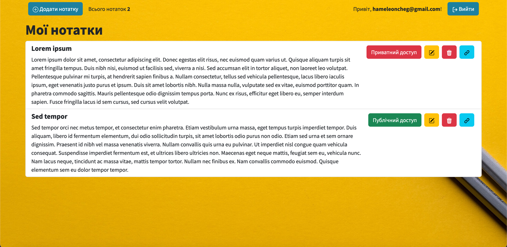
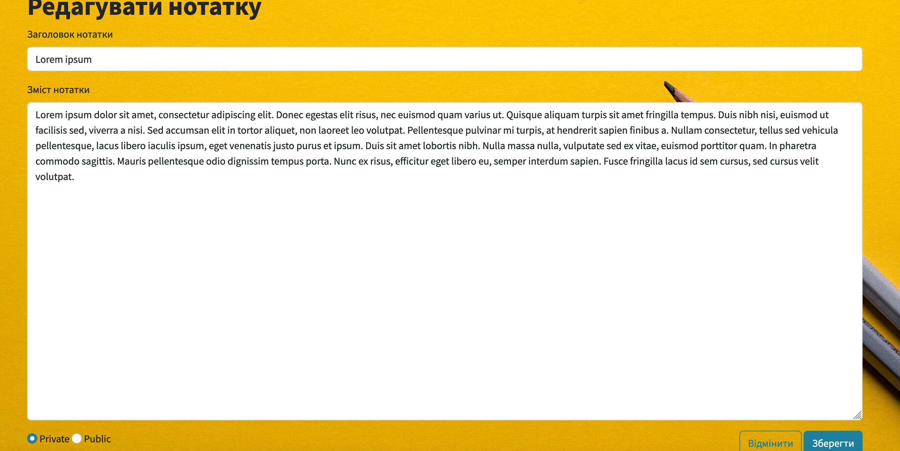

# Group 1  JAVA 8 GOIT
## _The Notepad_

[Notepad App Prod Link ](https://notepad.ldv.com.ua/)

Verify the deployment by navigating to your server address in
your preferred browser.
```sh
127.0.0.1:9999
```

Notepad is a java application with bootstrap frontend
## Environment Variables:
- `PROFILE` (default - `dev`; production - `prod`)
- `DB_URL`
- `DB_USERNAME`
- `DB_PASSWORD`

## Features

- Registration
- Create personal and public notes
- Share a note
- Delete note
- View notes list


## Tech

Notepad uses a number of open source projects to work properly:

- [Spring] - The Spring Framework is an application framework and inversion of control container for the Java platform.
- [Thymeleaf] - Java XML/XHTML/HTML5 template engine
- [Flyway] - Database migration tool
- [Bootstrap] - CSS framework
- [PostgreSQL] - Relational database management system
- [HTML] - HyperText Markup Language


And of course Notepad itself is open source with a [public repository](https://github.com/hameleoncheg1/java_dev_notepad)
on GitHub.

### Login page


### Register page


### Notes List page


### Edit note page



### Error note page


